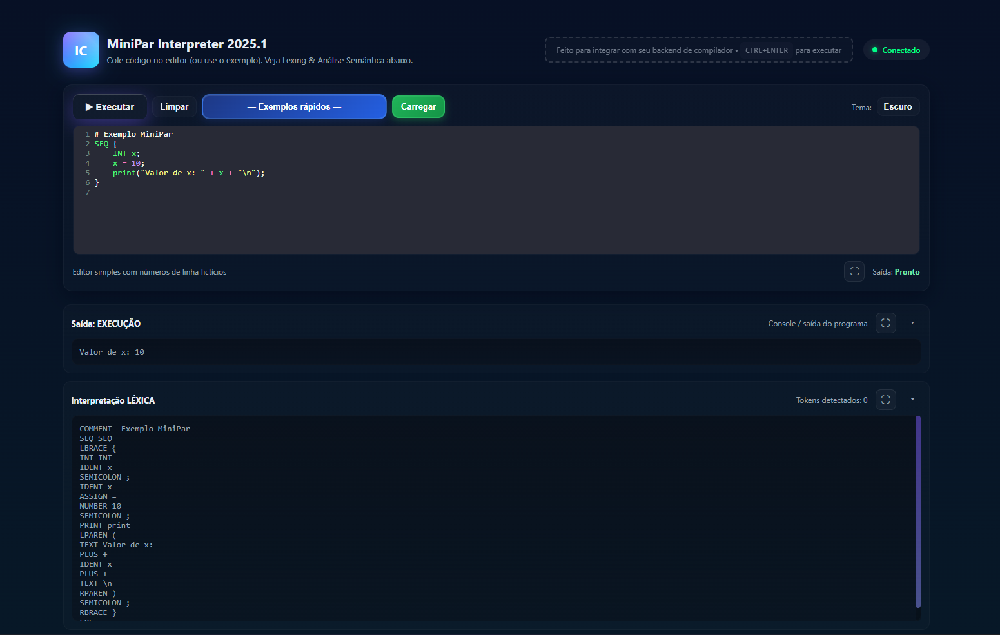
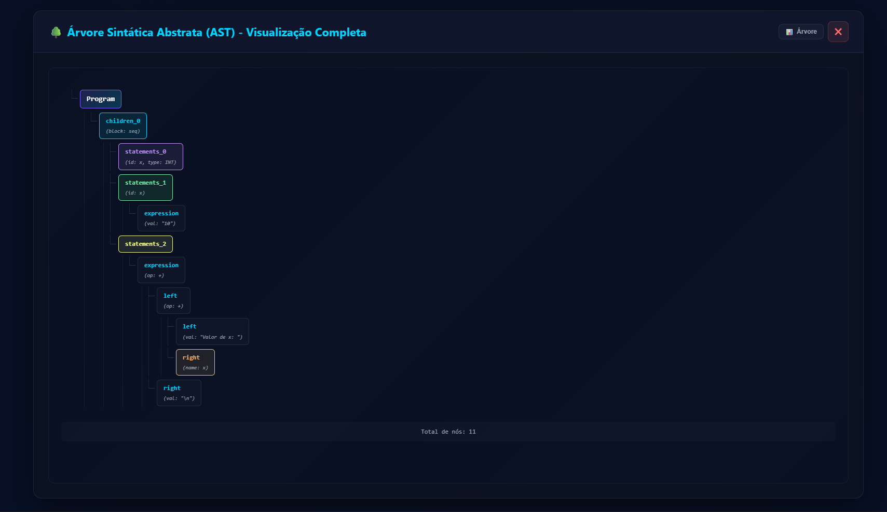
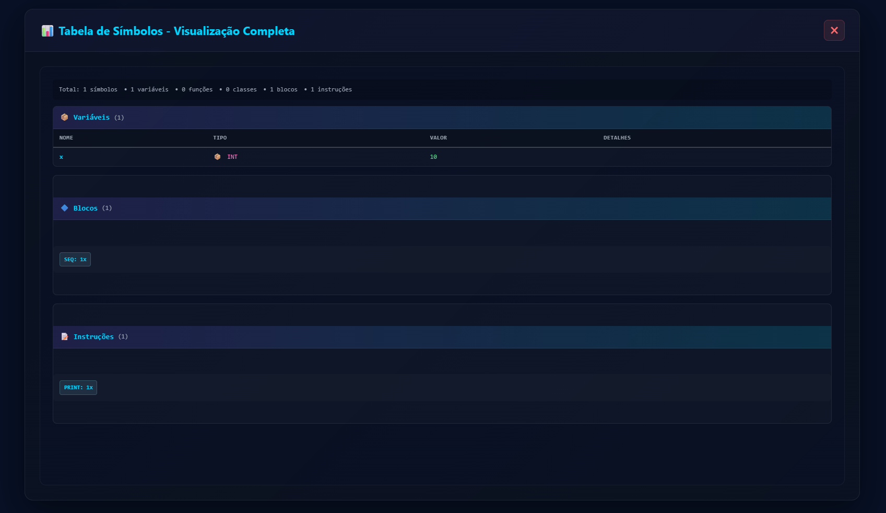
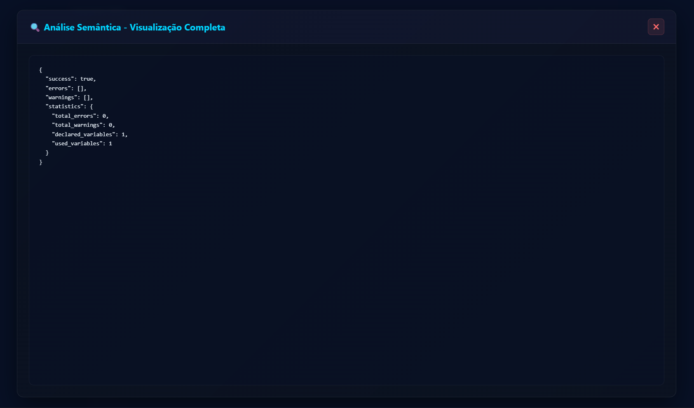
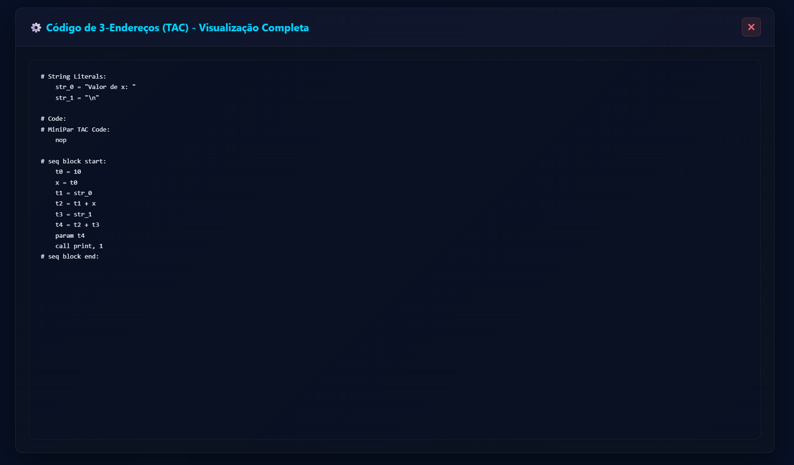

# 🚀 Interpretador MiniPar 2025.1 (Orientado a Objetos)

---

## 👥 Equipe de Desenvolvimento

- **Aldari Wanderley**
- **Guilherme Coutinho**
- **Marcos Melo**
- **Ruan Gomes**

**Professor Orientador:** Arturo Hernandez Dominguez  
**Disciplina:** Compiladores  
**Instituição:** UFAL - Universidade Federal de Alagoas

---

## ⚡ Início Rápido

```bash
# 1. Clone o repositório
git clone https://github.com/TheMarksan/minipar-interpreter-POO.git
cd minipar-interpreter-POO

# 2. Deploy automático (inicia todos os servidores)
./deploy.sh

# 3. Acesse a IDE no navegador
# Local:  http://localhost:8080
# Rede:   http://<SEU_IP>:8080
```

**Pronto!** Agora você pode escrever e executar programas MiniPar na interface web! 🎉

### 📊 O que foi iniciado:
- ✅ **Frontend** (porta 8080) - Interface web com editor
- ✅ **REST API** (porta 8000) - Backend para interpretação
- ✅ **WebSocket** (porta 8001) - Comunicação em tempo real

---

## 📌 Visão Geral
Este projeto implementa um **interpretador completo** para a linguagem **MiniPar 2025.1**, uma linguagem de programação orientada a objetos com suporte a **execução paralela**, **comunicação entre threads via canais** e **classes**.

O interpretador foi desenvolvido em **Python 3**, seguindo os princípios de **Programação Orientada a Objetos (POO)** e **Engenharia de Software**.

### 🎯 Principais Características
- ✨ **Interface Web Completa** - IDE com editor CodeMirror, syntax highlighting e painéis interativos
- 🔍 **Análise Completa** - Léxica, Sintática, Semântica e Geração de TAC
- 🧵 **Execução Paralela** - Suporte nativo a threads e comunicação via canais
- 🎨 **POO Completa** - Classes, herança, métodos, atributos e encapsulamento
- 📊 **Arrays Multidimensionais** - Suporte a arrays 1D e 2D
- 🐛 **Validação Robusta** - Detecção de erros em todas as fases da compilação
- 🌐 **Deploy Facilitado** - Scripts automáticos para deploy local e PythonAnywhere
- ⚡ **WebSocket** - Comunicação em tempo real com o backend
- 📊 **Visualização AST** - Árvore visual interativa e modo texto com highlighting

## ✨ Funcionalidades da Linguagem MiniPar

### Recursos Principais
- ✅ **Execução Sequencial (SEQ)** - Blocos de código executados em sequência
- ✅ **Execução Paralela (PAR)** - Threads para execução concorrente
- ✅ **Canais de Comunicação (C_CHANNEL)** - Comunicação entre threads
- ✅ **Programação Orientada a Objetos** - Classes, herança, métodos e atributos
- ✅ **Arrays Multidimensionais** - Arrays 1D e 2D com suporte completo
- ✅ **Funções Globais** - Definição e chamada de funções

### Tipos de Dados
- `INT` - Números inteiros
- `FLOAT` - Números de ponto flutuante
- `STRING` - Cadeias de caracteres
- `BOOL` - Booleanos (true/false)
- `CHAR` - Caracteres individuais
- `C_CHANNEL` - Canais de comunicação entre threads
- `VOID` - Sem retorno (para métodos/funções)

### Estruturas de Controle
- `if`/`else` - Condicionais
- `while` - Loops com condição
- `for` - Loops com inicialização, condição e incremento

### Operadores
- **Aritméticos:** `+`, `-`, `*`, `/`, `%`
- **Relacionais:** `==`, `!=`, `<`, `>`, `<=`, `>=`
- **Lógicos:** `&&`, `||`, `!`

### Entrada e Saída
- `print(...)` - Impressão na tela
- `input()` - Leitura do teclado
- `canal.send(valor)` - Envio via canal
- `canal.receive(var)` - Recepção via canal

### Outros Recursos
- Comentários com `#`
- Criação de objetos com `new`
- Acesso a atributos e métodos com `.`
- Suporte a `this` para referência ao objeto atual

---

## 🚀 Como Executar o Sistema

### Pré-requisitos
- **Python 3.8+** instalado
- Navegador web moderno (Chrome, Firefox, Edge, etc.)

### 1️⃣ Instalação e Configuração

Clone o repositório e navegue até o diretório:
```bash
git clone https://github.com/TheMarksan/minipar-interpreter-POO.git
cd minipar-interpreter-POO
```

### 2️⃣ Método Recomendado: Deploy Automático

O projeto inclui scripts de deploy automático que configuram tudo:

```bash
# Inicia todos os servidores
./deploy.sh
```

Este script:
- ✅ Cria ambiente virtual Python
- ✅ Instala dependências
- ✅ Inicia servidor HTTP (Frontend) na porta 8080
- ✅ Inicia servidor REST (Backend) na porta 8000
- ✅ Inicia servidor WebSocket na porta 8001
- ✅ Configura para aceitar conexões de **outras máquinas na rede**
- ✅ Salva logs em `logs/`

**Ver informações de acesso na rede:**
```bash
./show_network_info.sh
```

**Parar todos os servidores:**
```bash
./stop_servers.sh
```

### 3️⃣ Acessando a Interface Web

Abra seu navegador e acesse:

**Local:**
```
http://localhost:8080
```

**De outros dispositivos na mesma rede:**
```
http://<SEU_IP>:8080
```

Você verá a **IDE MiniPar** com:
- ✏️ Editor CodeMirror com syntax highlighting
- ▶️ Botão "Executar" para interpretar o código
- 📊 Painéis de resultados (Léxico, AST, Semântico, Tabela de Símbolos, TAC, Execução)
- 📁 Exemplos prontos categorizados
- 🎨 Tema escuro/claro
- 🌐 Indicador de conexão WebSocket

### 4️⃣ Testando o Sistema

**Via Interface Web:**
1. Acesse http://localhost:8080
2. Selecione um exemplo no menu dropdown ou digite seu código
3. Clique em "Executar" (ou Ctrl+Enter)
4. Veja os resultados nos painéis expansíveis

### 5️⃣ Deploy Manual (Alternativo)

Se preferir iniciar os servidores manualmente:

**Backend (REST API):**
```bash
python3 scripts/interpret_server.py --host 0.0.0.0 --port 8000
```

**Frontend (HTTP):**
```bash
python3 -m http.server 8080 --bind 0.0.0.0 --directory frontend
```

**WebSocket (Tempo Real):**
```bash
python3 server_websocket.py
```

### 🌐 Acesso de Outros Dispositivos na Rede

Para acessar de outros computadores/celulares na mesma rede:

1. **Descubra seu IP:**
   ```bash
   ./show_network_info.sh
   ```

2. **No outro dispositivo:**
   - Acesse: `http://<SEU_IP>:8080`

3. **Liberar firewall (se necessário):**
   ```bash
   sudo ufw allow 8080/tcp
   sudo ufw allow 8000/tcp
   sudo ufw allow 8001/tcp
   ```

**Via API REST:**
```bash
# Testar um programa específico
curl -X POST http://localhost:8000/interpretar \
  -H "Content-Type: application/json" \
  -d '{"code": "SEQ { INT x; x = 10; print(\"x = \" + x + \"\\n\"); }"}'
```

**Via Script Python Direto:**
```bash
cd minipar-interpreter-POO
python3 << 'EOF'
import sys
sys.path.insert(0, 'src')
from lexer.Lexer import Lexer
from parser.Parser import Parser
from semantic.SemanticAnalyzer import SemanticAnalyzer
from runtime.Interpreter import Interpreter

# Seu código MiniPar
code = """
SEQ {
    INT x;
    x = 10;
    print("Valor de x: " + x + "\\n");
}
"""

# Pipeline de compilação
lexer = Lexer(code)
tokens = lexer.tokenize()
parser = Parser(tokens)
ast = parser.parse()
analyzer = SemanticAnalyzer()
result = analyzer.analyze(ast)

if result['success']:
    interpreter = Interpreter()
    interpreter.interpret(ast)
else:
    print("Erros encontrados:")
    for error in result['errors']:
        print(f"  - {error}")
EOF
```

### 6️⃣ Parando os Servidores

```bash
# Parar todos os servidores (recomendado)
./stop_servers.sh

# Ou manualmente:
pkill -f "interpret_server.py"
pkill -f "http.server 8080"
pkill -f "server_websocket.py"
```

---

## 🌐 Deploy Remoto (PythonAnywhere)

Para disponibilizar o interpretador online gratuitamente:

### Passo 1: Preparar Deploy
```bash
./prepare_pythonanywhere.sh
```

Isso gera `minipar-pythonanywhere.tar.gz` (~124 KB) pronto para upload.

### Passo 2: Configurar PythonAnywhere

1. Crie conta gratuita em: https://www.pythonanywhere.com
2. Upload do arquivo `minipar-pythonanywhere.tar.gz`
3. Siga o guia completo em: **[PYTHONANYWHERE.md](PYTHONANYWHERE.md)**

### 📖 Documentação Completa de Deploy

Consulte o guia detalhado com screenshots e troubleshooting:
- **[PYTHONANYWHERE.md](PYTHONANYWHERE.md)** - Deploy gratuito passo a passo

### Características do Deploy Online
- ✅ **100% Gratuito** (plano básico)
- ✅ URL pública: `http://seu_usuario.pythonanywhere.com`
- ✅ Interface web completa funcional
- ✅ REST API funcionando
- ⚠️ WebSocket requer plano pago ($5/mês)

---

## 🏗️ Arquitetura do Interpretador

O interpretador é composto por **componentes de software** independentes:

### Pipeline de Compilação
1. **Analisador Léxico (Lexer)** - Tokenização do código fonte
2. **Analisador Sintático (Parser)** - Construção da AST (Abstract Syntax Tree)
3. **Analisador Semântico** - Validação de tipos, escopo e uso de variáveis
4. **Gerador de TAC** - Código intermediário Three-Address Code
5. **Interpretador/Runtime** - Execução do programa

### Componentes Principais
- **Lexer** (`src/lexer/`) - Análise léxica e tokenização
- **Parser** (`src/parser/`) - Análise sintática e construção da AST
- **SemanticAnalyzer** (`src/semantic/`) - Validações semânticas
- **SymbolTable** (`src/symbol_table/`) - Gerenciamento de escopos e símbolos
- **Interpreter** (`src/runtime/`) - Execução do código
- **ThreadManager** (`src/runtime/`) - Gerenciamento de threads paralelas
- **Channel** (`src/runtime/`) - Comunicação entre threads
- **TACGenerator** (`src/codegen/`) - Geração de código intermediário

### Modelagem UML
Documentação completa disponível em `docs/`:
- Diagramas de **casos de uso**
- **Arquitetura em componentes**
- **Diagrama de classes**
- **Fluxos de execução**

---

## 📂 Estrutura do Repositório
```bash
minipar-interpreter-POO/
├── frontend/                    # Interface web (HTML, CSS, JS)
│   ├── index.html               # Página principal da IDE
│   ├── home.css                 # Estilos da interface
│   ├── home.js                  # Lógica da interface
│   ├── ast-tree.js              # Renderizador visual de AST
│   └── websocket-client.js      # Cliente WebSocket
├── scripts/                     # Scripts auxiliares
│   └── interpret_server.py      # Servidor REST de interpretação
├── src/                         # Código-fonte do interpretador
│   ├── lexer/                   # Analisador léxico
│   │   ├── Lexer.py
│   │   ├── token.py
│   │   └── token_type.py
│   ├── parser/                  # Analisador sintático
│   │   ├── Parser.py
│   │   └── AST.py
│   ├── semantic/                # Analisador semântico
│   │   └── SemanticAnalyzer.py
│   ├── symbol_table/            # Tabela de símbolos
│   │   └── SymbolTable.py
│   ├── runtime/                 # Interpretador e runtime
│   │   ├── Interpreter.py
│   │   ├── ThreadManager.py
│   │   └── Channel.py
│   ├── codegen/                 # Gerador de código TAC
│   │   └── TACGenerator.py
│   └── utils/                   # Utilitários
│       └── ast_printer.py
├── tests/                       # Programas de teste em MiniPar
│   ├── hello_world.minipar
│   ├── programa1_cliente_servidor.minipar
│   ├── programa2_threads.minipar
│   ├── programa3_neuronio.minipar
│   ├── programa4_xor.minipar
│   ├── programa5_recomendacao.minipar
│   └── programa6_quicksort.minipar
├── docs/                        # Documentação técnica
│   ├── COBERTURA_GRAMATICA.md
│   ├── RESUMO_ATUALIZACAO_DOCS.md
│   └── pseudocode/              # Pseudocódigo dos componentes
├── deploy.sh                    # Script de deploy automático
├── stop_servers.sh              # Script para parar servidores
├── show_network_info.sh         # Mostrar IP e URLs de acesso
├── server_websocket.py          # Servidor WebSocket
├── prepare_pythonanywhere.sh    # Preparar pacote para PythonAnywhere
├── pythonanywhere_wsgi.py       # WSGI app para PythonAnywhere
├── PYTHONANYWHERE.md            # Guia de deploy remoto
├── requirements.txt             # Dependências Python
├── LICENSE                      # Licença MIT
└── README.md                    # Este arquivo
```

---

## 🎨 Interface Web - Recursos

A IDE web oferece uma experiência completa de desenvolvimento:

### 📸 Capturas de Tela

#### 1. Interface Principal — Editor, Saída e Tokens


**Descrição:**
- Editor CodeMirror com syntax highlighting (tema Dracula)
- Painel de execução mostrando saída do programa e tokens gerados

#### 2. Visualização da AST (Árvore de Sintaxe)


**Descrição:**
- Visualizador interativo da AST (modo árvore)
- Permite alternar para a vista texto e inspecionar nós

#### 3. Tabela de Símbolos


**Descrição:**
- Mostra variáveis, tipos e valores após execução
- Exibe blocos (SEQ/PAR) e instruções detectadas na análise semântica

#### 4. Análise Semântica


**Descrição:**
- Validação de tipos, escopos e uso correto de variáveis
- Mensagens de erro detalhadas quando há problemas
- Status de sucesso quando código está correto

#### 5. Código TAC (Three-Address Code)


**Descrição:**
- Código intermediário de três endereços gerado
- Útil para análise e otimização
- Mostra a representação em baixo nível do programa

---

### Editor de Código
- ✅ **CodeMirror** - Editor profissional com syntax highlighting
- ✅ **Numeração de linhas** - Facilita navegação
- ✅ **Atalhos** - Ctrl+Enter para executar
- ✅ **Temas** - Modo claro e escuro
- ✅ **Modal ampliado** - Edição em tela cheia com syntax highlighting

### Painéis de Resultado
Cada painel é expansível/colapsável com botão ⛶:

1. **📊 Léxico (Tokens)**
   - Lista todos os tokens identificados
   - Mostra tipo e valor de cada token
   - Contador de tokens no rodapé
   - Botão para copiar análise léxica

2. **🌳 AST (Árvore Sintática)**
   - **Modo Árvore**: Visualização hierárquica interativa
   - **Modo Texto**: Representação textual com highlighting
   - Toggle entre os dois modos
   - Navegação visual da estrutura do programa
   - Modal expansível para melhor visualização

3. **✅ Semântico**
   - Validações de tipo, escopo e uso
   - Mensagens de erro detalhadas
   - Status de sucesso/falha
   - Modal expansível

4. **📋 Tabela de Símbolos**
   - **Variáveis** com nome, tipo e **valor runtime** (verde para definidos!)
   - **Funções** com parâmetros e tipo de retorno
   - **Classes** com atributos e métodos
   - **Blocos** (SEQ, PAR) com contagem
   - **Instruções** (PRINT, IF, FOR, WHILE) com contagem
   - Estatísticas completas de símbolos
   - Modal expansível

5. **⚡ TAC (Three-Address Code)**
   - Código intermediário gerado
   - Representação de baixo nível
   - Contador de instruções TAC
   - Modal expansível

6. **▶️ Saída de Execução**
   - Output do programa (print, etc.)
   - **Paralelismo visível** - intercalação de threads
   - Erros de runtime
   - Modal expansível

### Recursos Adicionais
### Recursos da Interface

- 📁 **Exemplos Prontos** - Dropdown com programas categorizados
-  **WebSocket Status** - Indicador de conexão em tempo real
- 🧹 **Limpar** - Reseta editor e resultados
- 📤 **Exportar** - Copiar tokens, AST, etc.
- ⛶ **Ampliar** - Modal de tela cheia para cada painel
- 🎨 **Temas** - Alternar entre modo claro e escuro

---

## 📝 Exemplos de Código MiniPar

### Exemplo 1: Hello World
```minipar
SEQ {
    print("Hello, MiniPar!\n");
}
```

### Exemplo 2: Variáveis e Operações
```minipar
SEQ {
    INT x;
    INT y;
    INT soma;
    
    x = 10;
    y = 20;
    soma = x + y;
    
    print("x = " + x + "\n");
    print("y = " + y + "\n");
    print("soma = " + soma + "\n");
}
```

### Exemplo 3: Estrutura de Controle
```minipar
SEQ {
    INT i;
    
    print("Contando de 1 a 5:\n");
    for i = 1; i <= 5; i = i + 1 {
        print("i = " + i + "\n");
    }
}
```

### Exemplo 4: Classes e Objetos
```minipar
CLASS Calculadora {
    INT resultado;
    
    VOID somar(INT a, INT b) {
        this.resultado = a + b;
    }
    
    INT obterResultado() {
        return this.resultado;
    }
}

SEQ {
    Calculadora calc;
    INT res;
    
    calc = new Calculadora();
    calc.somar(15, 25);
    res = calc.obterResultado();
    
    print("Resultado: " + res + "\n");
}
```

### Exemplo 5: Threads e Canais
```minipar
C_CHANNEL canal;

VOID thread_produtor() {
    INT i;
    for i = 1; i <= 3; i = i + 1 {
        canal.send(i);
        print("Produtor enviou: " + i + "\n");
    }
}

VOID thread_consumidor() {
    INT valor;
    INT i;
    for i = 1; i <= 3; i = i + 1 {
        canal.receive(valor);
        print("Consumidor recebeu: " + valor + "\n");
    }
}

PAR {
    thread_produtor();
    thread_consumidor();
}
```

### Exemplo 6: Array e Loop
```minipar
SEQ {
    INT numeros[5];
    INT i;
    INT soma;
    
    # Preencher array
    for i = 0; i < 5; i = i + 1 {
        numeros[i] = i * 2;
    }
    
    # Calcular soma
    soma = 0;
    for i = 0; i < 5; i = i + 1 {
        soma = soma + numeros[i];
    }
    
    print("Soma dos elementos: " + soma + "\n");
}
```

---

## 🧪 Programas de Teste Disponíveis

Na pasta `tests/` você encontra programas completos para testar:

| Programa | Descrição | Recursos Demonstrados |
|----------|-----------|----------------------|
| `hello_world.minipar` | Hello World básico | Print básico |
| `programa1_cliente_servidor.minipar` | Cliente-servidor | Threads, canais, comunicação |
| `programa2_threads.minipar` | Threads paralelas | PAR, fatorial, fibonacci |
| `programa3_neuronio.minipar` | Neurônio artificial | Classes, métodos, arrays |
| `programa4_xor_cpp.minipar` | Rede neural XOR | POO avançada, loops, floats |
| `programa5_recomendacao.minipar` | Sistema de recomendação | Classes, herança, arrays 2D |
| `programa6_quicksort.minipar` | Algoritmo Quicksort | Recursão, arrays, parsing |

---

## 🐛 Solução de Problemas

### Servidores não iniciam

**Problema:** Portas já em uso

```bash
# Parar todos os servidores
./stop_servers.sh

# Ou verificar manualmente
lsof -i :8000  # REST API
lsof -i :8080  # Frontend
lsof -i :8001  # WebSocket

# Reiniciar
./deploy.sh
```

### WebSocket não conecta

**Sintomas:** Indicador vermelho "WebSocket: Desconectado"

**Soluções:**
1. Verificar se servidor WebSocket está rodando:
   ```bash
   ps aux | grep server_websocket.py
   ```

2. Verificar logs:
   ```bash
   tail -f logs/websocket.log
   ```

3. Reiniciar apenas WebSocket:
   ```bash
   pkill -f server_websocket.py
   python server_websocket.py &
   ```

### Interface não carrega / CSS quebrado

**Solução:**
```bash
# Limpar cache do navegador
Ctrl+Shift+R  # ou Cmd+Shift+R no Mac

# Verificar versão dos arquivos
./update_cache.sh

# Verificar se frontend está acessível
curl http://localhost:8080
```

### Erro "Module not found" no backend

```bash
# Ativar ambiente virtual
source venv/bin/activate

# Reinstalar dependências
pip install -r requirements.txt
```

### Código não executa

**Checklist:**
- [ ] Use `#` para comentários (não `//`)
- [ ] Todo código deve estar em blocos `SEQ` ou `PAR`
- [ ] Declare variáveis antes de usar
- [ ] Verifique painel "Semântico" para erros
- [ ] Strings devem usar aspas duplas `"`

### Deploy PythonAnywhere não funciona

Consulte troubleshooting detalhado em: **[PYTHONANYWHERE.md](PYTHONANYWHERE.md)**

Problemas comuns:
- Versão errada do Python (use 3.10)
- USERNAME incorreto no WSGI
- Virtualenv path errado
- Dependências não instaladas

---

## 📊 Status do Projeto

- ✅ Análise Léxica completa
- ✅ Análise Sintática completa
- ✅ Análise Semântica completa
- ✅ Geração de TAC
- ✅ Interpretador funcional
- ✅ Suporte a threads e canais
- ✅ POO (Classes, herança, métodos)
- ✅ Interface web completa
- ✅ WebSocket para tempo real
- ✅ Deploy automatizado
- ✅ Deploy remoto (PythonAnywhere)

## 🎯 Tecnologias Utilizadas

**Backend:**
- Python 3.8+
- asyncio (WebSocket)
- http.server (REST API)

**Frontend:**
- HTML5 / CSS3 / JavaScript ES6+
- CodeMirror (Editor de código)
- WebSocket API (Comunicação tempo real)

**Deploy:**
- Scripts Bash
- PythonAnywhere (WSGI)
- Git

---

## 🔗 Links Úteis

- 📖 [Especificação da Linguagem (BNF)](src/BNF.md)
- 📘 [Guia de Deploy PythonAnywhere](PYTHONANYWHERE.md)

---

## 📄 Licença

Este projeto foi desenvolvido para fins acadêmicos como parte da disciplina de Compiladores da UFAL.

**MIT License** - Veja [LICENSE](LICENSE) para mais detalhes.

---


